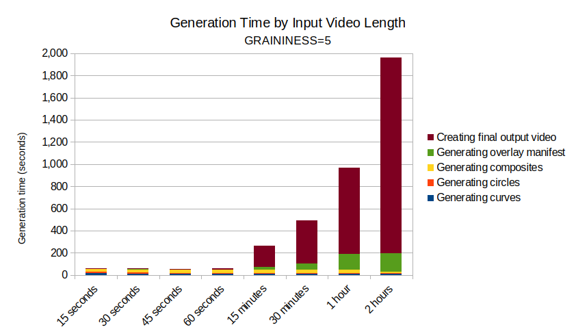

# dynamic-filmgrain

A command-line-only script for bash that generates a pseudo-random old film grain effect (scratches and dust) and overlays it onto a source video file. The overlay images are composed with ImageMagick from pseudo-random curves and circles, composited into unique frames, and blended with the source using ffmpeg.

[](assets/preview.gif)

---

## Example

```bash
./create-filmgrain.sh pilot.mp4 output.mp4 5 "-map 0:a? -c:a copy -loglevel panic"
```


> **Note:** By default, the script encodes only the first video stream for a given input. ``-map 0:a?`` or a similar parameter set is required to include additional streams in the output.

---

## Requirements

The following tools must be available in `PATH`:

| Tool | Purpose | Install |
|---|---|---|
| `ffmpeg`and`ffprobe` | Video encoding and overlay and Extracting source video metadata  | `sudo apt install ffmpeg` |
| `convert` | Frame generation and compositing (ImageMagick 6) | `sudo apt install imagemagick` |
| `bc` | Floating point arithmetic | `sudo apt install bc` |

> **Note:** This script uses `convert` (ImageMagick 6); ImageMagick 7's `magick` binary is not required.

### Install all dependencies at once

```bash
sudo apt install ffmpeg imagemagick bc
```

Or using the included package list:

```bash
xargs -a requirements.apt sudo apt-get install -y
```

---

## Usage

```
./create-filmgrain.sh <input> <output> [graininess] [additional_ffmpeg_params]
```

**Or via Docker**:

```
docker run --rm -v <host path to media assets>:/data <image name> /data/<input> /data/<output> [graininess] [additional_ffmpeg_params]
```

### Arguments

| Argument | Required | Default | Description |
|---|---|---|---|
| `input` | Yes | n/a | Path to the source video file |
| `output` | Yes | n/a | Path to the output video file |
| `graininess` | No | `5` | Integer (≥ 2) controlling the intensity of the graininess effect |
| `additional_ffmpeg_params` | No | empty | Additional flags passed to ffmpeg during the final encode step |

> **Note:** By default, the script encodes only the first video stream for a given input. `-map 0:a?` or a similar parameter set is required to include additional streams in the output.


### Examples

Using defaults:
```bash
./create-filmgrain.sh input.mp4 output.mp4
```

With specific graininess:
```bash
./create-filmgrain.sh input.mp4 output.mp4 3
```

With additional ffmpeg flags:
```bash
./create-filmgrain.sh input.mp4 output.mp4 5 "-loglevel panic -map 0:a? -c:a copy"
```

---

## Configuration

Advanced parameters are defined near the top of the script under the **Internal Parameters** section. These do not need to be changed for normal use.

| Parameter | Default | Description |
|---|---|---|
| `W_GEN` / `H_GEN` | `640` / `480` | Resolution at which grain frames are generated |
| `MIN_THICKNESS` / `MAX_THICKNESS` | `1` / `2` | Stroke width range for curves |
| `STEP_X` / `STEP_Y` | `30` / `25` | Maximum coordinate step between curve control points |
| `MIN_RADIUS` / `MAX_RADIUS` | `1` / `3` | Circle radius range in pixels |
| `COLOR` | `#BFBFBF` | Stroke color for all drawn shapes |
| `POOL_BEZIER` / `POOL_CIRCLES` | `50` / `50` | Number of unique frames generated for each pool |
| `MAX_COMPOSITES` | `720` | Number of composite frames built from the pools |

Overlay images are generated at `W_GEN x H_GEN` and scaled to match the source video dimensions in the final encoding pass.

---

## Output

The script produces a single video file (typically an H.264 `.mp4`) at the source video's original resolution, framerate, and duration, with the grain layer at 35% opacity.

> **Note:** The opacity level may be made configurable in the future.

---

## Guardrails

- Input must be a video format readable by ffmpeg (and ffprobe)
- Audio and other streams are passed through only if `-map 0:a? -c:a copy` is included in `additional_ffmpeg_params`. Additional preferences for the ffmpeg encoding can ba passed in this argument as well.
- `GRAININESS` must be 2 or greater

---

## Performance

Generation time scales with `POOL_BEZIER`, `POOL_CIRCLES`, `MAX_COMPOSITES`,  the `GRAININESS`parameter and the length and framerate of the video specified by the`input`parameter — the defaults are tuned for a balance of variety and speed and may be tweaked in the future. The length of the video specified by the `input` parameter accounts for the generation time of the output manifest, up to 8.33%, and the generation of the final output accounts, up to 89.86%, of the total variance. Results for `GRAININESS=5` are displayed below:



---

## A Note on Randomness and Permutations

The script mimics the behavior of film grain dust and scratches by generating imagery according to a subjective pseudo-random algorithm, subject to the following:

$$N_A, N_B \in \left[\left\lfloor \frac{GRAININESS}{2} \right\rfloor,\ 2\left\lfloor \frac{GRAININESS}{2} \right\rfloor - 1\right]$$

$$[CurvesPool]^{N_A} \times [CirclesPool]^{N_B}$$

Where $CurvesPool$ and $CirclesPool$ are currently set to 50.

Therefore, at`GRAININESS=2`,  the number of unique possible images from which the composites can be generated is:
$$50^1 \times 50^1 = 2{,}500$$

And at`GRAININESS=5`the upper bound is:
$$50^3 \times 50^3 \approx 1.56 \times 10^{10}$$

The series of 50 curves and 50 circles are shuffled to a pseudo-random order, following the [Fisher-Yates method](https://en.wikipedia.org/wiki/Fisher%E2%80%93Yates_shuffle). Additional shuffled sequences are created until a set is created that is sufficient to allow for `MAX_COMPOSITES` frames, each with up to 3 source images, such as would be required at `GRAININESS=5`.

`MAX_COMPOSITES`(currently 720) composite frames are built by sampling between 1 and 3 source images from the set of shuffled sequences. This number of frames was chosen to target a maximum gap between repeats of 30 seconds at 24 fps.

The expected number of frames before a repeat of the same composite follows the [Birthday Problem](https://en.wikipedia.org/wiki/Birthday_problem). The expected number of composites before a collision is approximately:

$$E[\text{repetition}] \approx \sqrt{\frac{\pi \cdot 720}{2}} \approx 33.6$$

Depending on the framerate, viewers may notice repeat frames at the following theoretical maximums:
| Framerate | Composites available | Expected gap between repeats | Maximum gap between repeats
|---|---|---|---|
| 24 fps | 720 | ~1.4 seconds | 30 seconds | 
| 15 fps | 720 | ~2.2 seconds | 48 seconds |
| 8 fps | 720 | ~4.2 seconds | 90 seconds |

Creating a non-repeating sequence of composite images lasting 30 seconds at 24 fps would require 330,024 composites:

$${\frac{\sqrt{\frac{\pi \cdot 330,024}{2}}}{24}} \approx {\frac{720}{24}}\approx30$$

Generating this many frames would be prohibitively expensive with regard to performance. This may be addressed in a future iteration.

---

## To Do:

 * Add additional guardrails, as appropriate
  * Improve performance and throughput
 * Make grain opacity configurable with a command-line argument and defaulting
 * Make the overlay durations configurable to allow for the appearance of a slower framerate

---

## License

MIT — see [LICENSE](LICENSE)
